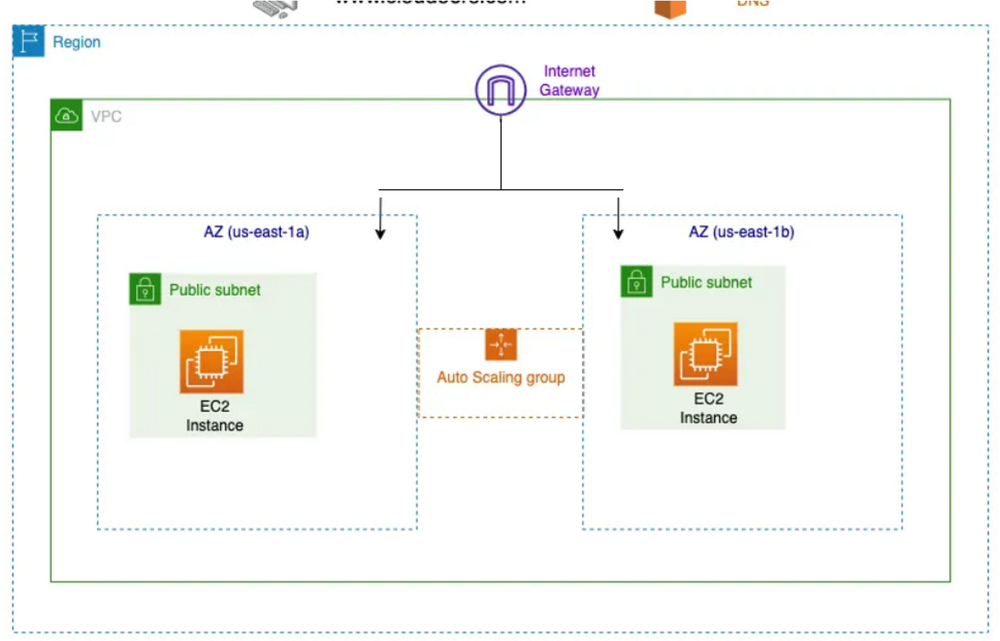

============================================================================

Project:1 One-tier
------------------

This project is a simple one-tier architecture that deploys an EC2 instance in AWS using Terraform. The configuration includes the necessary provider settings and variable definitions to specify the AWS region.

